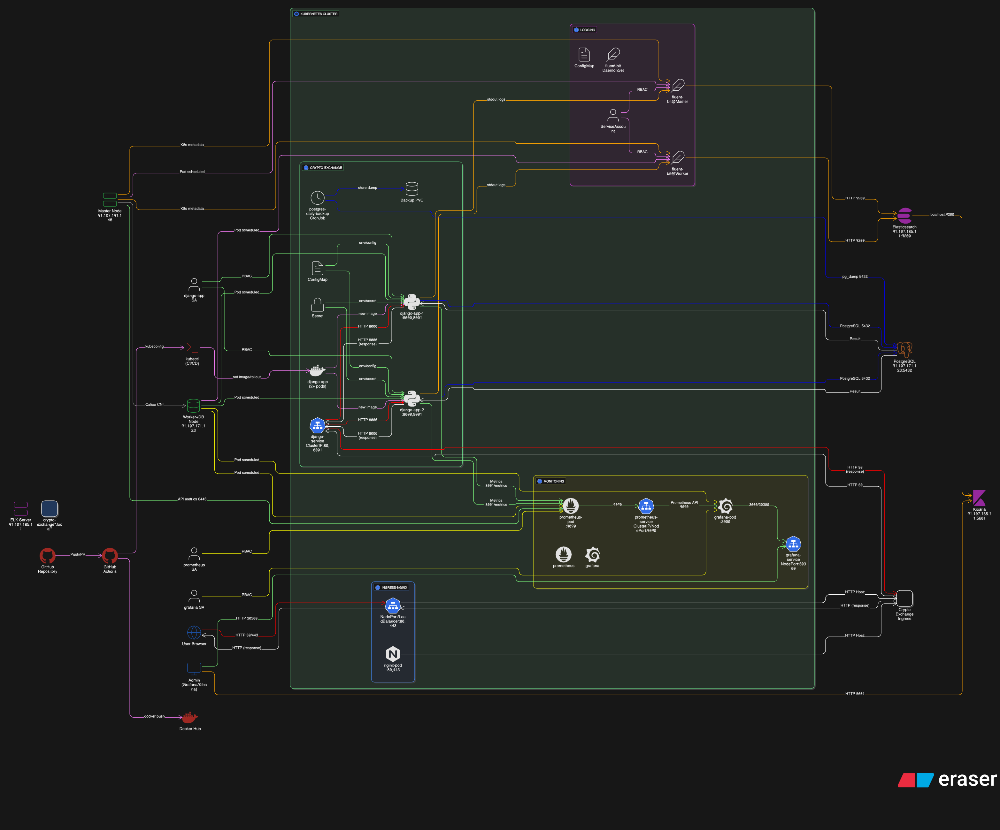

# BitPin Project Documentation


## Proposal
### Overview
The Crypto Exchange (BitPin) project delivers a Django-based web application for digital asset management with a modern, scalable cloud-native architecture. The project utilizes Docker for containerization, Kubernetes for orchestration, continuous integration and delivery (CI/CD) via GitHub Actions, and robust monitoring through Prometheus and Grafana.




**Key Solutions:**
- **Django App** containerized with Docker.
- **External PostgreSQL DB** running on a dedicated worker node.
- **Kubernetes** cluster with Calico networking and Ingress-NGINX for traffic routing.
- **CI/CD** automated pipeline with GitHub Actions, Docker Hub, and `kubectl` deploy.
- **Monitoring** includes Prometheus for metrics collection and Grafana for visualization.
- **Logging** Elasticsearch has been setup as single node with Fluentbit to gathering and collect logs from pods.

## Table of Contents

- [Execution Instructions & Architecture](#execution-instructions--architecture)
  - [1. Preparation](#1-preparation)
    - [a. Database Server (External)](#a-database-server-external)
    - [b. Docker Image Build](#b-docker-image-build)
    - [c. Kubernetes Cluster Setup](#c-kubernetes-cluster-setup)
  - [2. Application Deployment](#2-application-deployment)
    - [a. Kubernetes Manifests](#a-kubernetes-manifests)
    - [b. Secrets and Configuration](#b-secrets-and-configuration)
    - [c. Ingress & DNS](#c-ingress--dns)
    - [d. Monitoring](#d-monitoring)
  - [3. CI/CD Pipeline](#3-cicd-pipeline)
  - [4. Step-by-Step Operations](#4-step-by-step-operations)
    - [a. Local Development](#a-local-development)
    - [b. GitOps in Kubernetes](#b-gitops-in-kubernetes)
    - [c. Monitoring & Observability](#c-monitoring--observability)
    - [d. Access](#d-access)
- [Best Practices & Recommendations](#best-practices--recommendations)
- [What's Next?](#whats-next)

---

## Execution Instructions & Architecture

### 1. Preparation

#### a. Database Server (External)
- Install PostgreSQL on a worker node.
- Harden database access via UFW/firewall rules restricting to master node, ELK server, and worker node IPs.
- Create required DB, user, password, and grant privileges.
- Configure `listen_addresses` and `pg_hba.conf` for secure remote access.

#### b. Docker Image Build
- All application code, `Dockerfile`, and dependencies reside in the `Exchange/` directory.
- Docker image build context is set to `./Exchange` in CI/CD.
- Publish the image to Docker Hub upon successful build.

#### c. Kubernetes Cluster Setup
- Use kubeadm to bootstrap cluster with Calico CNI.
- Deploy Ingress-NGINX for HTTP routing.
- Install Prometheus and Grafana in a dedicated `monitoring` namespace.

### 2. Application Deployment

#### a. Kubernetes Manifests
- Store manifests in `manifests/v2/`.
- Configure `django-deployment.yaml` and services to connect to the external PostgreSQL (`DATABASE_HOST` set to external endpoint).
- Service exposes ports:
  - `80` (for app traffic → port `8000` in container)
  - `8001` (for `/metrics` endpoint → port `8001` in container)

#### b. Secrets and Configuration
- Use `Secret` for sensitive values:
  - `DATABASE_PASSWORD`
  - `DJANGO_SECRET_KEY`
- Use `ConfigMap` for environment:
  - `DATABASE_NAME`, `DATABASE_USER`, `DATABASE_HOST`, `DATABASE_PORT`, etc.

#### c. Ingress & DNS
- Ingress resource exposes `crypto-exchange.local` domain.
- Map this domain to the ingress controller IP via `/etc/hosts` for developer/lab access.

#### d. Monitoring
- Prometheus config includes job:

```bash
scrape_configs:
- job_name: 'django-app'
metrics_path: /metrics
static_configs:
- targets: ['django-service.crypto-exchange:8001']
```
- Django is instrumented with `django-prometheus` and `/metrics` path.
- Grafana uses Prometheus as a data source with dashboards for app, DB, and cluster health.

---

### 3. CI/CD Pipeline

- Workflow file path: `.github/workflows/ci-cd.yml`
- Key steps:
1. Checkout code
2. Build Docker image from `Exchange/`
3. Push image to Docker Hub
4. Set up `kubectl` with base64 kubeconfig
5. Update Kubernetes deployment (`kubectl set image ...`) and rollout
- Required GitHub secrets:
- `DOCKER_USERNAME`
- `DOCKER_PASSWORD`
- `KUBE_CONFIG` (base64 encoded)

---

### 4. Logging & ELK Stack

- Elk Stack Setup:
1. Elasticsearch deployed on dedicated server `91.107.185.11`, listening on port `9200`.
2. Kibana installed alongside Elasticsearch on the same server, exposed on port `5601`.
3. Elasticsearch secured with username/password authentication `(e.g. user: elastic).`
4. Single-node Elasticsearch configured using `discovery.type: single-node` for simplicity and stability.
5. Firewall restricts access to Elasticsearch and Kibana ports to trusted IPs.

- Fluent Bit Setup in Kubernetes
1. Deploy Fluent Bit as a DaemonSet in Kubernetes logging namespace to run on all nodes.
2. Fluent Bit configuration inputs:
   - Tail logs from `/var/log/containers/*.log`.
   - Kubernetes metadata enrichment filter for logs.
3. Output configuration:
    - Sends logs to Elasticsearch on `91.107.185.11:9200`.
    - Uses `Index fluentbit-k8s` (without deprecated `_type` field).
    - Secure authentication with `elastic` user credentials.
    - TLS disabled for internal secure network segments.
4. Tips & Best Practices for ELK and Fluent Bit:
   - Avoid legacy configs: Ensure Fluent Bit does not use `Logstash_Format` On or `es_type` these cause Elasticsearch 8.x rejections.
   - Index naming: Use a simple static index name or date suffix for organized log storage.
   - Resource limits: Constrain Fluent Bit with reasonable CPU and memory limits in the DaemonSet.
   - RBAC: Grant Fluent Bit minimal required permissions to read pod and namespace info.
   - Secure credentials: Inject passwords via Kubernetes Secrets, never hardcoded in ConfigMaps.
   - Scaling: Fluent Bit DaemonSet ensures log collection from all nodes automatically.
  
- Verifying Logs in Kibana:
1. Create a data view (index pattern) `fluentbit-k8s*` in Kibana.
2. Use Discover page with filters for namespaces, pods or labels (e.g. `kubernetes.namespace_name: "crypto-exchange"`).
3. Build dashboards and saved searches to monitor app-specific logs and error trends.
   
---

### 5. Step-by-Step Operations

#### a. Local Development
- Test locally with Docker Compose if needed.
- Validate dependencies and Django configuration.

#### b. GitOps in Kubernetes
- Commit/push to main branch triggers pipeline.
- New Docker image built and deployed automatically.

#### c. Monitoring & Observability
- Access Grafana via NodePort: `http://NODE_IP:30300` (default: user `admin`, pass `admin123`).
- Build dashboards showing:
- Django request counts, latency, errors
- Pod CPU/memory usage
- Database connectivity/status

#### d. Access
- Application is available at `http://crypto-exchange.local:<nodePort>`.
- Metrics are available to Prometheus for scraping at `/metrics`.

#### e. Logging Access and Analysis
- View application logs centrally via Kibana.
- Use tailored filters and saved searches.
- Troubleshoot errors and observe performance trends.


---

## Best Practices & Recommendations

- Use `stringData` for Kubernetes secrets to avoid base64 errors.
- Ensure all service and deployment ports match between manifests and Prometheus configuration.
- Scale deployments with Kubernetes `replicas`.
- Restrict access/ingress rules as needed for security.
- Monitor logs and probe failures to catch issues early.

---

This document captures the project scope, solution design, deployment steps, and future directions for ongoing improvements and scaling.
