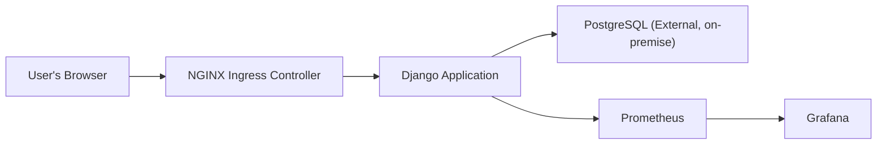

# BitPin Project Documentation



## Proposal
### Overview
The Crypto Exchange (BitPin) project delivers a Django-based web application for digital asset management with a modern, scalable cloud-native architecture. The project utilizes Docker for containerization, Kubernetes for orchestration, continuous integration and delivery (CI/CD) via GitHub Actions, and robust monitoring through Prometheus and Grafana.

**Key Solutions:**
- **Django App** containerized with Docker.
- **External PostgreSQL DB** running on a dedicated worker node.
- **Kubernetes** cluster with Calico networking and Ingress-NGINX for traffic routing.
- **CI/CD** automated pipeline with GitHub Actions, Docker Hub, and `kubectl` deploy.
- **Monitoring** includes Prometheus for metrics collection and Grafana for visualization.

---

## Execution Instructions & Architecture

### 1. Preparation

#### a. Database Server (External)
- Install PostgreSQL on a worker node.
- Create required DB, user, password, and grant privileges.
- Configure `listen_addresses` and `pg_hba.conf` for secure remote access.

#### b. Docker Image Build
- All application code, `Dockerfile`, and dependencies reside in the `Exchange/` directory.
- Docker image build context is set to `./Exchange` in CI/CD.
- Publish the image to Docker Hub upon successful build.

#### c. Kubernetes Cluster Setup
- Use kubeadm to bootstrap cluster with Calico CNI.
- Deploy Ingress-NGINX for HTTP routing.
- Install Prometheus and Grafana in a dedicated `monitoring` namespace.

### 2. Application Deployment

#### a. Kubernetes Manifests
- Store manifests in `manifests/v2/`.
- Configure `django-deployment.yaml` and services to connect to the external PostgreSQL (`DATABASE_HOST` set to external endpoint).
- Service exposes ports:
  - `80` (for app traffic → port `8000` in container)
  - `8001` (for `/metrics` endpoint → port `8001` in container)

#### b. Secrets and Configuration
- Use `Secret` for sensitive values:
  - `DATABASE_PASSWORD`
  - `DJANGO_SECRET_KEY`
- Use `ConfigMap` for environment:
  - `DATABASE_NAME`, `DATABASE_USER`, `DATABASE_HOST`, `DATABASE_PORT`, etc.

#### c. Ingress & DNS
- Ingress resource exposes `crypto-exchange.local` domain.
- Map this domain to the ingress controller IP via `/etc/hosts` for developer/lab access.

#### d. Monitoring
- Prometheus config includes job:

```bash
scrape_configs:
- job_name: 'django-app'
metrics_path: /metrics
static_configs:
- targets: ['django-service.crypto-exchange:8001']
```
- Django is instrumented with `django-prometheus` and `/metrics` path.
- Grafana uses Prometheus as a data source with dashboards for app, DB, and cluster health.

---

### 3. CI/CD Pipeline

- Workflow file path: `.github/workflows/ci-cd.yml`
- Key steps:
1. Checkout code
2. Build Docker image from `Exchange/`
3. Push image to Docker Hub
4. Set up `kubectl` with base64 kubeconfig
5. Update Kubernetes deployment (`kubectl set image ...`) and rollout
- Required GitHub secrets:
- `DOCKER_USERNAME`
- `DOCKER_PASSWORD`
- `KUBE_CONFIG` (base64 encoded)

---

### 4. Step-by-Step Operations

#### a. Local Development
- Test locally with Docker Compose if needed.
- Validate dependencies and Django configuration.

#### b. GitOps in Kubernetes
- Commit/push to main branch triggers pipeline.
- New Docker image built and deployed automatically.

#### c. Monitoring & Observability
- Access Grafana via NodePort: `http://NODE_IP:30300` (default: user `admin`, pass `admin123`).
- Build dashboards showing:
- Django request counts, latency, errors
- Pod CPU/memory usage
- Database connectivity/status

#### d. Access
- Application is available at `http://crypto-exchange.local:<nodePort>`.
- Metrics are available to Prometheus for scraping at `/metrics`.

---

## Best Practices & Recommendations

- Use `stringData` for Kubernetes secrets to avoid base64 errors.
- Ensure all service and deployment ports match between manifests and Prometheus configuration.
- Scale deployments with Kubernetes `replicas`.
- Restrict access/ingress rules as needed for security.
- Monitor logs and probe failures to catch issues early.

---

## What’s Next?

### Setting Up ELK Stack for Log Management

**Steps:**

1. **Install Elasticsearch** on a dedicated node for scalable log storage and search capabilities.
2. **Deploy Logstash or Fluent Bit** on Kubernetes cluster nodes to collect and forward logs from pods and containers to Elasticsearch.
3. **Deploy Kibana** to visualize and explore logs efficiently.
4. **Configure Fluent Bit** as a lightweight log forwarder inside your Kubernetes cluster.
5. **Integrate ELK with existing monitoring** solutions for a comprehensive observability platform.

---

This document captures the project scope, solution design, deployment steps, and future directions for ongoing improvements and scaling.
